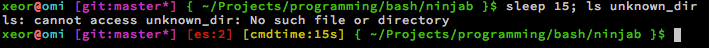

:::warning Old post for historical reasons
This post is not relevant anymore. The ninjab project had it's last commit in 2017. If you want a cool promt now (2021), try out https://github.com/romkatv/powerlevel10k for example
:::

There are a lot of colorful Linux prompts out there already, but most of them tends to be all about beeing colorful, not useful.
[Ninjab] tries to be as useful as it can be in your day-to-day Linux management. It is made to be configurable, and easy to add your own bash hacks.

This blog-post is mostly to get some screenshots out, more info is available on the github page, and in the bash scripts themself.

## Here is a couple of examples on how it behaves in different situations. ##

#### In normal writable folder, as a normal (green) user, undefined http_proxy (red @), and over ssh (cyan) hostname. ####

#### Same as above, but truncated (directory is max 1/3 of screen width) ####

#### After a long running process ####

#### Inside a clean git folder in the master branch ####

#### Inside a dirty (uncommited changes) git repo, after a failed command (with exit code != 0) that took a long time to run ####

#### Inside a git repo with +1 committed change, with a tmux session running (but we are not in), and 3 background prosesses, and no write access to the current folder ####

Everything in the prompt means something, the color of the username, @ and hostname.

This is one part of ninjab. It will also set a couple of aliases, functions and shell settings.
Take a look at the file in parts/* for more info about them
There is also a lot of configurations for ninjab in the "config" file.

If you want your own bash stuff loaded by ninjab, just put your files in the "parts" folder.

More documentation is available on the github page.

[Ninjab]: https://github.com/xeor/ninjab